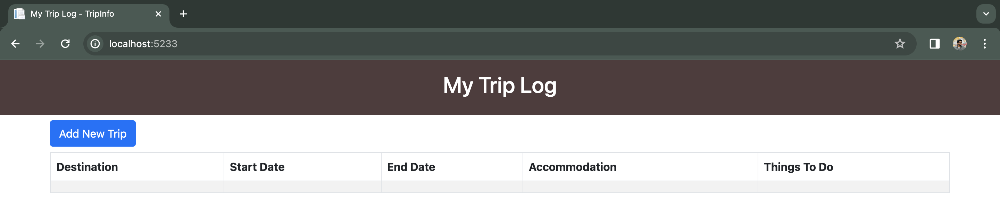
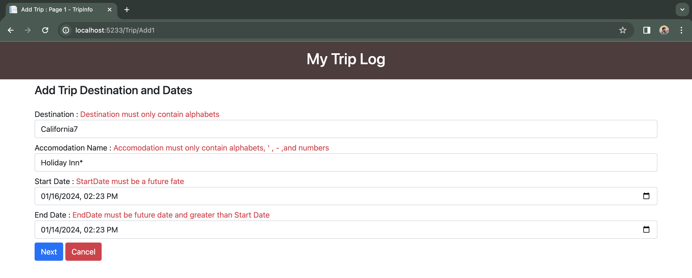
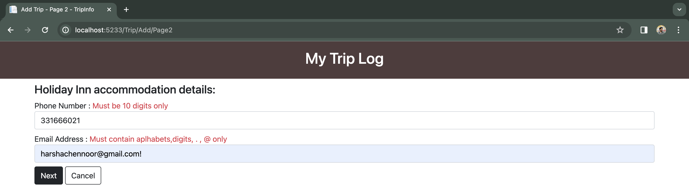
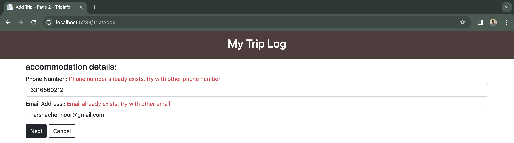
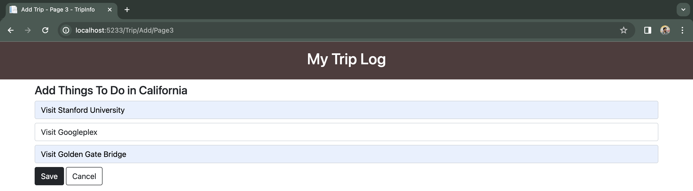
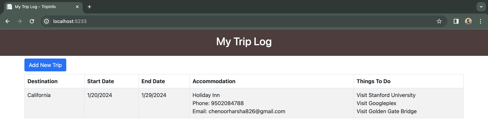

# **My Trip Log**

### Overview
This is an ASP.NET MVC project with **[donet framework](https://github.com/Harshachennoor/TripInfo/blob/master/TripInfo.csproj#L4)**. 
Packages used in this project are listed in [TripInfo.csproj](https://github.com/Harshachennoor/TripInfo/blob/master/TripInfo.csproj#L10) with version numbers.

This multi-page web application uses [Session](https://github.com/Harshachennoor/TripInfo/blob/master/Controllers/TripController.cs#L44) and [Cookies](https://github.com/Harshachennoor/TripInfo/blob/master/Controllers/TripController.cs#L104) to transfer data between the pages.

Client-side Validation is implemented to validate the user entries using DataAnnotations.<br>
[Server-side Validation](https://github.com/Harshachennoor/TripInfo/blob/master/Controllers/TripController.cs#L64) is implemented to validate the user entries for Email and PhoneNumber with existing records in [Trips.sqlite](https://github.com/Harshachennoor/TripInfo/blob/master/Trips.sqlite) file.<br>
Custom Validation is implemented to check [Start Date](https://github.com/Harshachennoor/TripInfo/blob/master/Models/Trip.cs#L27) and [End Date](https://github.com/Harshachennoor/TripInfo/blob/master/Models/Trip.cs#L50).

[Trip Controller](https://github.com/Harshachennoor/TripInfo/blob/master/Controllers/TripController.cs) contains logic used to navigate between the pages.

[Views](Views) folder contains the HTML code.

### Getting Started:

  Download the project and use the following CLI commands in the terminal to view the Output.<br>
  
  ```dotnet restore```<br>
  ```dotnet build```<br>
  ```dotnet run```<br>
  
  See the info: which contains the localhost link with port number

### Sample Outputs 
* Initial Home Page:

  

* Both Client and Server-side Validations of Add1 page:

  

* Add2 Validations:
  
  * Client-side Validation:
 
    

  * Server-side Validation:
 
    

* Add3 Page with Destination value passed using Session:

  

* Home Page with Data passed using Cookie:

  
    


